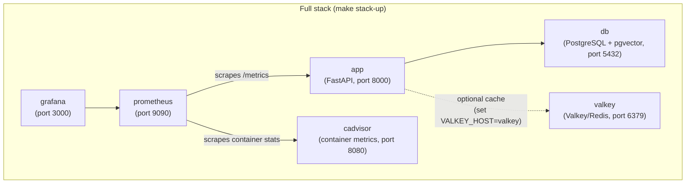

# Docker

## Services



Valkey is always started but only used by the app when `VALKEY_HOST=valkey` is set in your `.env` file. Without it the app falls back to an in-memory cache.

The `app` container has a health check that polls `/health` with Python's
`urllib` (the `python:3.13-slim` base image has no `curl`). It reports
`healthy` once the API answers and the database is reachable — `/health`
returns 503 when the database is down, which fails the probe.

## Compose v1 vs v2

The Makefile invokes Compose through the `DOCKER_COMPOSE` variable, which
defaults to the standalone v1 binary `docker-compose`. Recent Docker ships
Compose as a *plugin* (`docker compose`, no hyphen) and may not install that
binary at all. If the Docker targets fail with `docker-compose: command not
found`, either pass the v2 form per invocation:

```bash
make docker-up DOCKER_COMPOSE="docker compose"
```

or set it once for your shell:

```bash
export DOCKER_COMPOSE="docker compose"
```

## Commands

### API + database only (most common for development)

```bash
make docker-up ENV=development     # start
make docker-down ENV=development   # stop
make docker-logs ENV=development   # tail logs
```

### Full stack (includes Prometheus + Grafana)

```bash
make stack-up ENV=development      # start everything
make stack-down ENV=development    # stop everything
make stack-logs ENV=development    # tail all service logs
```

### Build a custom image

```bash
make docker-build ENV=production
```

This runs `scripts/build-docker.sh` which builds and tags the image for the specified environment.

## Running migrations inside Docker

After `make docker-up`, run migrations **inside the app container**:

```bash
make docker-migrate ENV=development
```

This runs `alembic upgrade head` in the container, where the Compose service
name `db` resolves. Related targets: `make docker-migrate-downgrade` and
`make docker-migrate-history`.

`make migrate` runs Alembic from your host instead. That only works if
`POSTGRES_HOST` points somewhere reachable from the host — with the
Docker-oriented `POSTGRES_HOST=db` it fails with
`could not translate host name "db"`. Use `docker-migrate` for the
containerised database, or set `POSTGRES_HOST=localhost` for the local-Python
workflow.

## Environment files

Each environment needs a `.env.<env>` file:

```bash
cp .env.example .env.development
cp .env.example .env.staging
cp .env.example .env.production
```

The `docker-up` and `stack-up` commands pass the env file to Docker Compose via `--env-file`. Make sure `POSTGRES_HOST=db` in your Docker env files (not `localhost`) — the service name within the Compose network is `db`.

## Grafana

After `make stack-up`, Grafana is available at [http://localhost:3000](http://localhost:3000).

**Default credentials: `admin` / `admin`** (set by `GF_SECURITY_ADMIN_PASSWORD`
in `docker-compose.yml`; change it before exposing Grafana anywhere).

Everything is provisioned from files on first start — there is nothing to click
through after `make stack-up`:

| File | Provides |
|---|---|
| `grafana/datasources/prometheus.yml` | The `Prometheus` datasource, pointing at `http://prometheus:9090` |
| `grafana/dashboards/dashboards.yml` | The file provider that loads dashboards from `json/` |
| `grafana/dashboards/json/llm_latency.json` | The **LLM Inference Latency** dashboard |

One dashboard ships today — *LLM Inference Latency*, at
`/d/llm-latency/llm-inference-latency` — with four panels: p95 inference
duration, p95 stream duration, average inference duration, and inference
request rate.

### Adding a dashboard

Drop the JSON into `grafana/dashboards/json/` and restart Grafana. Save the
**dashboard object itself** at the top level, not the
`{"dashboard": {...}, "overwrite": true}` envelope that Grafana's HTTP import
API and its *Share → Export* button produce. The file provisioner does not
unwrap that envelope; it reports
`failed to load dashboard ... error="Dashboard title cannot be empty"` and skips
the file. Reference the datasource by the name `Prometheus`.

### Grafana shows no data

Grafana keeps its own state in the `grafana-storage` volume. If provisioning
changes do not appear, recreate it:

```bash
docker compose --env-file .env.development rm -sf grafana
docker volume rm my-agent_grafana-storage
make stack-up ENV=development
```

Note that the LLM panels use `rate()` over a time window, so they are empty
until the agent has actually served a chat request — and restarting the `app`
container resets its in-process counters.
