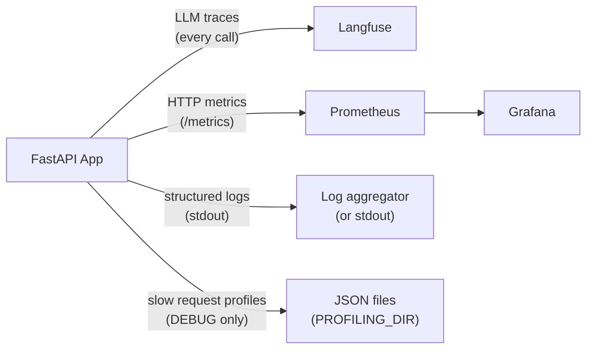

# Observability

## Overview



---

## Langfuse — LLM tracing

Every LLM call is traced via the LangChain `CallbackHandler`. Traces include:

- Input messages and output
- Token usage and cost
- Latency per call and per session
- Model name, temperature, and other parameters

**Setup:**

```bash
LANGFUSE_TRACING_ENABLED=true
LANGFUSE_PUBLIC_KEY=pk-...
LANGFUSE_SECRET_KEY=sk-...
LANGFUSE_HOST=https://cloud.langfuse.com   # or your self-hosted URL
```

**Disable for local dev:**

```bash
LANGFUSE_TRACING_ENABLED=false
```

`.env.example` ships with tracing **disabled** and placeholder keys, so a fresh
checkout sends nothing to Langfuse and logs `langfuse_tracing_disabled` at
startup. Set the flag to `true` *and* supply real `pk-lf-…`/`sk-lf-…` keys
before expecting traces to appear.

Traces are also used as the data source for the [evaluation framework](evaluation.md),
so evals have nothing to score while tracing is off.

---

## Self-hosted Langfuse

The Compose stack can run Langfuse locally, behind an opt-in `langfuse`
profile so `make stack-up` stays light:

```bash
make langfuse-up      # UI on http://localhost:3001
make langfuse-logs    # tail web + worker
make langfuse-down
```

### What it starts

| Service | Purpose | Host port |
| --- | --- | --- |
| `langfuse-web` | UI and ingestion API | 3001 |
| `langfuse-worker` | Async trace processing | — |
| `langfuse-clickhouse` | Trace/observation storage | — |
| `langfuse-minio` | S3-compatible blob storage | 9190 (console 9191) |
| `langfuse-redis` | Queues | — |
| `langfuse-postgres` | Projects, users, settings | — |

Only the UI and MinIO publish a host port; everything else is reachable on the
Compose network only. Services and volumes are namespaced (`langfuse-*`) so
they never collide with the app's own `db` and `valkey`, and the host ports are
shifted off Langfuse's defaults because Grafana already owns 3000 and
Prometheus 9090.

### Version pinning

The server is pinned to the **v3** images to match the `langfuse==3.9.1` SDK in
`pyproject.toml`. Langfuse v4 replaced batch ingestion with OpenTelemetry and
rejects older SDKs, so moving the server to v4 means bumping the SDK to
`>=4.7.0` and reworking `app/core/observability.py` in the same change. (SDK v4
is backwards compatible with a v3 server, so the SDK can be upgraded first.)

### First-boot provisioning

The `LANGFUSE_INIT_*` variables create the organization, project and login user
on first boot, and mint the API keys from `LANGFUSE_PUBLIC_KEY` /
`LANGFUSE_SECRET_KEY`. Nothing needs to be clicked in the UI — start the
containers, set `LANGFUSE_TRACING_ENABLED=true`, and traces appear. Sign in
with `LANGFUSE_INIT_USER_EMAIL` / `LANGFUSE_INIT_USER_PASSWORD`.

These variables only take effect against an **empty** database. Changing them
later has no effect unless you also recreate the `langfuse-postgres` volume.

### Host vs. browser URL

`LANGFUSE_HOST` must be `http://langfuse-web:3000` — the service name and
internal port, as seen from inside the app container. Your browser uses
`http://localhost:3001`. Pointing `LANGFUSE_HOST` at `localhost` makes the app
try to reach itself and tracing silently fails.

### Verifying it works

```bash
curl http://localhost:3001/api/public/health
curl -u "$LANGFUSE_PUBLIC_KEY:$LANGFUSE_SECRET_KEY" \
  "http://localhost:3001/api/public/traces?limit=5"
```

App-side, a successful connection logs `langfuse_auth_success` at startup;
a bad key logs `langfuse_auth_failure`.

---

## Structured logging

All logs use [structlog](https://www.structlog.org/) in a consistent format:

- **Development**: coloured console output
- **Production**: JSON (pipe to your log aggregator)

Every log line automatically carries `request_id`, `session_id`, and `user_id` when available — bound by `LoggingContextMiddleware`.

### Log format conventions

```python
# Good
logger.info("chat_request_received", session_id=session.id, message_count=5)

# Never
logger.info(f"chat request received for {session.id}")  # no f-strings
logger.error("something failed", error=str(e))          # use logger.exception for exceptions
```

Rules:

- Event names are `lowercase_with_underscores`
- Variables are keyword arguments, never interpolated into the event string
- Use `logger.exception()` (not `.error()`) when inside an `except` block — preserves the full traceback

### Log levels by environment

| Environment | Level |
| --- | --- |
| development | DEBUG |
| staging | INFO |
| production | WARNING |

---

## Prometheus metrics

Metrics are exposed at `GET /metrics` and scraped by Prometheus.

| Metric | Type | Description |
| --- | --- | --- |
| `http_requests_total` | Counter | Request count by method, endpoint, status |
| `http_request_duration_seconds` | Histogram | Request latency by method, endpoint |
| `llm_inference_duration_seconds` | Histogram | LLM call latency by model |
| `llm_stream_duration_seconds` | Histogram | Streaming call latency by model |
| `db_connections` | Gauge | Active database connections |
| `session_names_generated_total` | Counter | Sessions auto-named by the title model |

Start the full stack with `make stack-up ENV=development` and open
[http://localhost:3000](http://localhost:3000) — credentials **`admin` / `admin`**.

The Prometheus datasource and one dashboard, **LLM Inference Latency**, are
provisioned automatically from `grafana/`. It plots p95 inference duration, p95
stream duration, average inference duration, and inference request rate — all
from the two `llm_*_duration_seconds` histograms above. The panels use `rate()`
over a window, so they stay empty until the agent has served a chat request.

Prometheus itself is at [http://localhost:9090](http://localhost:9090), and the
raw metrics are always available at `GET /metrics` on the API whether or not the
monitoring stack is running. See [docker.md](docker.md#grafana) for adding
dashboards.

---

## Request profiling (debug only)

When `DEBUG=true`, `ProfilingMiddleware` profiles every request using [pyinstrument](https://github.com/joerick/pyinstrument). When a request exceeds `PROFILING_THRESHOLD_SECONDS`, a JSON report is saved to `PROFILING_DIR`.

Each report file is named `{request_id}.json` and contains:

```json
{
  "request_id": "...",
  "endpoint": "POST /api/v1/chatbot/chat",
  "wall_time_ms": 1842,
  "cpu_time_ms": 145,
  "io_wait_ms": 1697,
  "memory_peak_kb": 4820,
  "top_memory_allocators": [...],
  "call_tree": {...}
}
```

Set `PROFILING_THRESHOLD_SECONDS=0` to profile every request.

The `request_id` in the filename matches the `X-Request-ID` response header, so you can correlate profiles with specific log lines.

---

## Request ID propagation

Every request gets a unique `X-Request-ID` header via [`asgi-correlation-id`](https://github.com/snok/asgi-correlation-id). This ID is:

- Returned in the response headers
- Bound to every log line for that request
- Used as the filename for profile reports

Use the `X-Request-ID` from a response to grep logs, find profiles, and look up Langfuse traces for that exact request.
